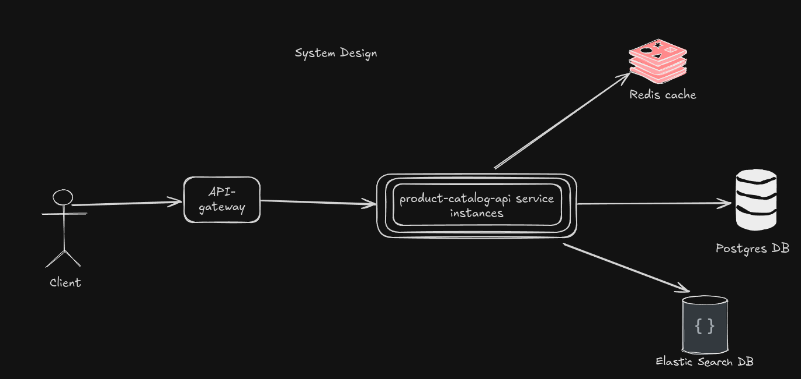

# Product Catalog Service System Design

This is a design document for a robust dynamic product catalog micro-service search api

## System limitations

- 50 million products listed
- 10 million monthly active users
- Average user activity is 10 search per month

## Requirements

### Business Requirements

- Supplier => Can add/update new products
- Category => (example: Fashion, Electronics, Video games or Groceries)
- Product => Have attributes (example: size, color, shape), the main service component, add by supplier
- Product variants => Product can have many variants

- Implement only the search REST API that searches in the product catalog and ranks the results based on the best-selling products

  - Search should support any product attribute search, along with free text search

- Product catalog should support product variants

  - T-Shirt is a product
  - T-Shirt (Red, Small, V-Neck) is a product and a variant to that product as well
  - T-Shirt (Green, Medium, Rounded-Neck) is a product and a variant to that product as well
  - T-Shirt (Green, Small, V-Neck) is a product and a variant to that product as well

- Products can be of any category, (example: Fashion, Electronics, Video games or Groceries)

- Products are linked to suppliers, each supplier can add their own product

### Technical Requirements

- Programming: the task should be implemented using NodeJs
- Database: use any database system (SQL, NoSQL or both)
- Error Handling: the system should gracefully handle errors and provide meaningful feedback

## Assumptions

- Supplier can create/update/delete their own product, like adding attributes, update price, etc...
- Supplier will create product-variant under it's main product, category and will have flexible attributes schema.
- Selling will be sent from external service or via update product-variant.
- We need a transactional database to force business requirement of the product, category, supplier and product-variant schemas
- We need strong consistency result from the search api
- We will need to handle heavy-read operation for this system limitation: 40 query/sec, so we will need another search database such as Elastic search
- Elastic search to handle the heavy-read searching queries, ranking (Eventual consistency)
- Searching with attribute meaning it's strict search (must exist on the product), and the relation between them is AND on the search query
- I assumed that different product-variants have different attributes

## Questions (Answer without designing the solution, only mention what you think)

- What would you change in the solution if the ranking will be based on most viewed items or the most/best reviewed?
  - Answer: **When I first read the requirement and system limitation of this service, my first thought goes to elastic search as eventual searching database (eventual because I will need to sync it asynchronously) so the ranking will be on the elastic search, almost what we need is to change the ranking query from our product-catalog service if elastic search already contain the ranking key, if not, then we will need to re-sync our main consistent database to elastic search again with the new schema contain the ranking field**
- How would you think about linking relevant products together?

  - Answer: **I think we will need to create a separate table for the product and product-variants, this way we can say that product-variants linked to the same product are relevant**
  - How would the system know they are relevant to be recommended?
    - Answer: **We can have multiple criteria of doing so, for example the basic thing we can do is product-variant will have another variants recommended if they have the same parent product with the most intersected attributes sorted by the best-selling**

- How would you think about securing such service?
  - Answer: **We can secure this service by enforcing query validation, using anti sql injection orm such as Prisma, add api-gateway with rate limiting and jwt authentication**
- What would be the type of servers needed for such like service? would it be RAM or CPU optimized types of machines and why?
  - Answer: **For the product-catalog-api service we will need to be CPU optimized because we will have many concurrent I/O, for the elastic search we will need it to be RAM optimized for the indexing cache**

## Infrastructure

### System Design



The needed component to run this micro-service

- Elastic search cluster: Mainly serve the search queries, can be scalable, will return product ids and then full product will be fetched from postgres database
- BullMQ: Sync between our main database and Elastic search, this is can be from background job running to fetch the data from queue and insert/create/update elastic search index
- Postgres database: for transactions (support ACID for the business model),
- Redis: Cache Layer for products after fetched from postgres database, This is can be user query cache or cache by product id, the second approach more useful for invalidate the cache
- CI/CD: Github actions, docker, docker-compose for automatic deployments
- Load balancer: for api traffic

## Database design

### Products:

- id (UUID, PK) // UUIDv7 chosen here for global uniqueness over distributed system (since we make a micro-service database design :)
- name (Text)
- category_id (FK)
- supplier_id (FK)
- created_at
- ... more fields for business need

### Variants:

- id (UUID, PK)
- product_id (FK)
- attributes JSONB // as it's not receiving updates frequently, we can also access specific fields using ->> or @> operators
- supplier_id (FK)
- category_id (FK)
- price: DECIMAL
- stock: INTEGER // number of available to sell
- sku (Text)
- created_at TIMESTAMP
- total_sold INTEGER

### Suppliers:

- id (UUID, PK)
- name
- contact_info

### Categories:

- id (UUID, PK)
- name

### Products (Elastic Search):

```json
{
  id: UUID, // the variant_id
  search_text: text, // accumulated title + attribute values on one field to support queries like: Red t-shirt (red is an attributed)
  attributes: { color: string, ... } // object contains all the variant attributes for filtering
  total_sold: number, // ranking field
}
```

## API Design

### Search endpoint

- Path: `api/v0/products/search`
- Method: GET
- Query:
  - query: String // required for the full-text search
  - filter: Object => searchAttribute="search word"
  - skip: number (default: 0)
  - limit: number (default: 50)
  - final query will looks like: `?query=over-size T-Shirt&filter[size]=Large&filter[color]=red`
- Authorization: Not required for this task
- Authentication: Not required for this task

#### Implementation Details

- This endpoint will call the elastic search service with the tuned user query
- elastic search will return the results with product ids sorted in the way it should appear to the user (This guarantee search consistency)
- get the product from postgres using the fetched ids from elastic search, join with product, supplier, category if needed
- The result from postgres will be cached on redis for future use
- Returns
  - Data: {totalCount: number, products: [] } with status code 200
  - Error: This service may not available if the elastic search is down or gives timeout with status code 504
  - Error: Bad request, validation error

### Variants Creation/Syncing to Elastic

- There are many analyzers our their in elastic search, I chose a simple one that do the job well and add some pre-indexing staff:
  - I use `whitespace` analyzer as it's a simple one for full-text search this analyzer use whitespace to split phrases into words, the search much the spitted words
  - Add the attributes to the indexed field to allow queries where the user search with attribute name inside the full-text search
  - Lower cased the indexed field because the whitespace analyzer doesn't have the lowercase sensitivity on the search, I also search with query in lowercase
  - As I said in the assumptions part that attributes will be used for exact filtering and said that the attributes are different for different product-variants so I used dynamic template to map elastic search schema attributes and make it of type `keyword`
- You can create mock data with `../create-script.js` either you need to create data from scratch inside postgres and index it to elastic or you need to sync between postgres data and elastic index, you can uncomment the needed function and run the script with `node create-script.js` it will make 1 Million dummy record inside variants table and elastic index
- I didn't go much on the update/delete path as the main purpose for this assessment is to create the search endpoint but I have write that any new create/update/delete in the variants table should be syncing using background job that will fetch the update from a message queue asynchronously.

## Benchmarking

TODO: Will make a benchmark on my machine for this service and provide it here
